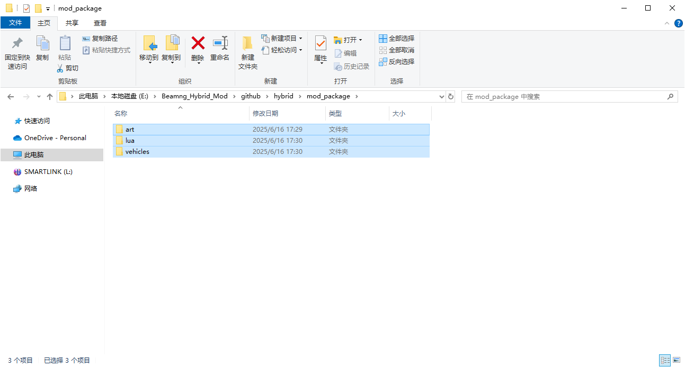
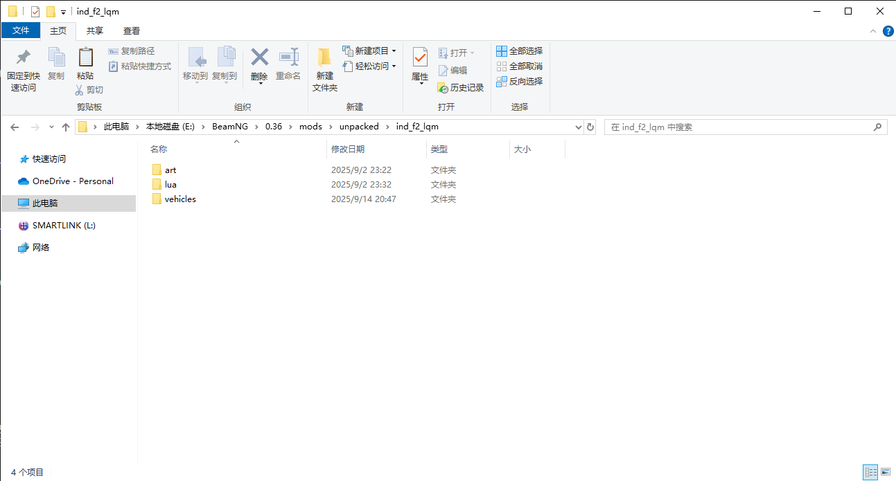
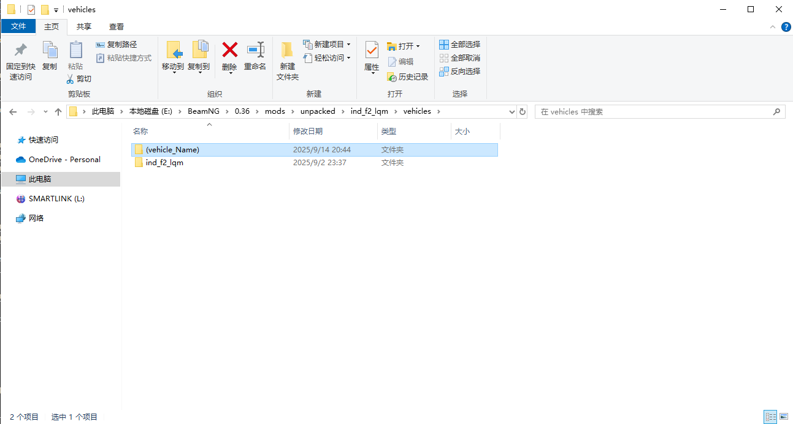
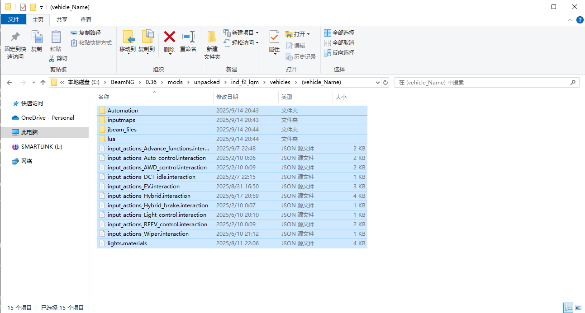
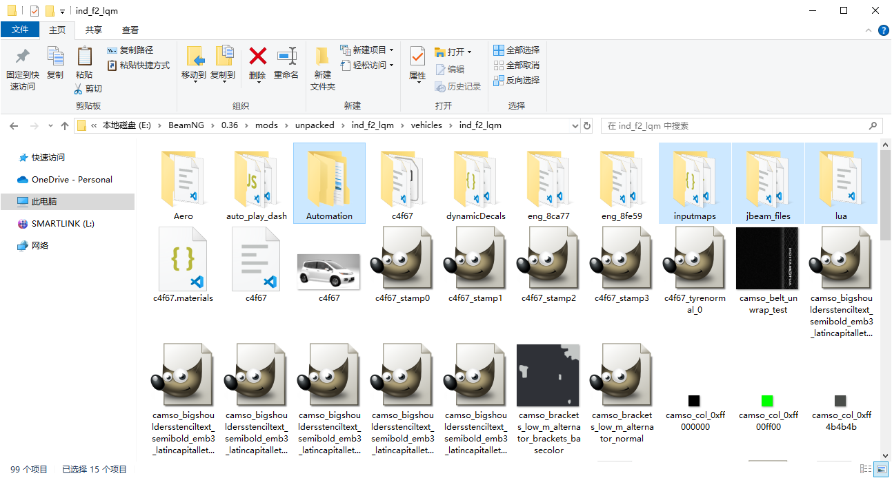

**Read in other languages: [English](README.md), [汉语](README_zh.md).**\
**TODO List: [TODO List](TODO_LIST.md).**

# This is a mod for ICE cars exported from automation the car company tycoon game in BeamNG.drive to turn into hybrid cars or EVs exported from the game to get a advance electric control.

# If you want to submit content containing this mod to a media platform, please indicate this repository URL.

Here is the guide for using it.

Suggestion: Download and install [Visual Studio Code](https://code.visualstudio.com/) or [Visual Studio Codium](https://vscodium.com/) and [JBeam extension for vscode](https://marketplace.visualstudio.com/items?itemName=beamng.jbeam-editor) [JBeam extension in vsix](https://marketplace.visualstudio.com/_apis/public/gallery/publishers/beamng/vsextensions/jbeam-editor/0.4.3/vspackage) first.

## Hybrid

 1. Export the car and cancel "Zip-Pack Mod".
    

 2. Download the pack and latest release from GitHub.

   [Main Mod](https://github.com/NiZhaZi/Beamng_Hybrid_and_EV_Mod/archive/refs/heads/main.zip) or pull the repository via [Git](https://git-scm.com)\
   [.pc File Editor](https://github.com/NiZhaZi/Hybrid-PC-Edit/releases)\
   [Toque Table Creator](https://github.com/NiZhaZi/Torque-Table-Creator/releases)\
    
    
    

 3. Unzip the zip file from the first link of step 2 (or pulled files). Copy all files under "mod_package" folder to the mod folder of exported car.\
    Open "vehicles" folder in mod folder, copy all the files in "(vehicle_Name)" folder and paste them to the car name folder.

    
    
    
    
    
    

 4. Run the .exe file downloaded from the second link. Choose the form of hybrid and click the "copy" button.

    

 5. Open the .pc file of the car which is waiting for being modified and paste the content under "parts" part. Comment the duplicate lines. If the function is not needed, the content in the quotation marks can be deleted.

    
    
    

 6. Start the game and choose the car to check if the car was modified correctly. Some parts can be exchanged in the game menu.

    
    

 7. ~~The "controller" part of the "main" slot of the car can be edited like this to allow AI in the game to drive the modified car.~~

    

    Now the mod can replace the vehicle controller automatically, so this step is no longer necessary.


## EV
   1. Export the car and cancel "Zip-Pack Mod".

      

   2. Download the pack from GitHub.

      [Main Mod](https://github.com/NiZhaZi/Beamng_Hybrid_and_EV_Mod/archive/refs/heads/main.zip) or pull the repository via Git\
      [Toque Table Creator](https://github.com/NiZhaZi/Torque-Table-Creator/releases)
      
      

   3. Unzip the zip file from the first link of step 2. Copy all files under "EV" folder to the folder of exported car.

      

   4. Copy the code under.

      ```
      "Camso_Engine": "Advance_Engine_ElectricController",
      // "Motor_Drive_Type": "Front_Single_Rear_None",
      // "Motor_Drive_Type": "Front_Dual_Rear_None",
      // "Motor_Drive_Type": "Front_None_Rear_Single",
      // "Motor_Drive_Type": "Front_None_Rear_Dual",
      "Motor_Drive_Type": "Front_Single_Rear_Single",
      // "Motor_Drive_Type": "Front_Single_Rear_Dual",
      // "Motor_Drive_Type": "Front_Dual_Rear_Single",
      // "Motor_Drive_Type": "Front_Dual_Rear_Dual",

      "Camso_ElectricMotor_F": "Single_ElectricMotor_F",
      // "Camso_ElectricMotor_F": "Dual_ElectricMotor_F",
      "Camso_ElectricMotor_R": "Single_ElectricMotor_R",
      //"Camso_ElectricMotor_R": "Dual_ElectricMotor_R",
      "Camso_differential_front": "Single_motor_differential_front",
      // "Camso_differential_front": "Dual_motor_differential_front",
      "Camso_differential_rear": "Single_motor_differential_rear",
      // "Camso_differential_rear": "Dual_motor_differential_rear",

      "Camso_DSE": "EV_DSE_01",
      "Camso_TC": "EV_TC",
      "Camso_ESC": "EV_ESC",
      "Camso_DriveModes": "EV_DriveModes_01",

      "Dynamic_System": "",
      "Dynamic_awd": "",
      "Dynamic_lsd": "",
      "Rear_Wheel_Steering": "",
      "Suspension_Lift": "",
      ```

   5. Open the .pc file of the car which is waiting for being modified and paste the content under "parts" part. Comment the duplicate lines. If the function is not needed, the content in the quotation marks can be deleted.

      

   6. Start the game and choose the car to check if the car was modified correctly.

      


## Extensional Functions (for .pc files)

   ```
   "Camso_tpms": "Camso_tpms_4w",
   "camso_tuning_parameters": "camso_tuning_parameters",
   
   "Lights_Control": "Lights_Control",
   "Wiper_Control": "Wiper_Control",
   "Dynamic_System": "Dynamic_System",
   "Dynamic_awd": "Dynamic_awd",
   "Dynamic_lsd": "Dynamic_lsd",
   "Rear_Wheel_Steering": "Rear_Wheel_Steering",
   "Suspension_Lift": "Suspension_Lift",
   ```
   Adapted to mods: [MK's Dynamic Weather](https://www.beamng.com/resources/mks-dynamic-weather.33820/), [Advanced Driver Assistance Systems](https://www.beamng.com/resources/advanced-driver-assistance-systems.17384/)


## Automation Description Scriptions

   Replace the "indexNumber"s with fixtures' index number and put them into Automation game's description box to use.

   1. Steering Wheel
   ```
   ~prop:indexNumber,steering,0,1,0,0,0,0,-900,900,0,1~
   ```

   2. Pedals and Parking Brake (For pedals' first number, -1 represents firewall mount and 1 represents floor mount.)
   ```
   ~prop:indexNumber,throttle_input,-1,0,0,0,0,0,0,40,0,10~
   ~prop:indexNumber,brake_input,-1,0,0,0,0,0,0,40,0,10~
   ~prop:indexNumber,clutch_input,-1,0,0,0,0,0,0,40,0,10~
   ~prop:indexNumber,parkingbrake_input,1,0,0,0,0,0,0,10,0,10~
   ```

   3. Pointers (For the second number, -1 represents clockwise and 1 represents counterclockwise. 
      The eighth number represents the maxium pointer angle. 
      The tenth number should be pointer angle value devided by source value.)
   ```
   ~prop:indexNumber,rpmTacho,0,-1,0,0,0,0,0,270,0,0.03~
   ~prop:indexNumber,wheelspeed,0,-1,0,0,0,0,0,360,0,2.95~
   ```
   
   4. Extensional Functions (need additional control)
   ```
   ~prop:indexNumber,hourNeedle,0,-1,0,0,0,0,0,360,0,1~
   ~prop:indexNumber,minuNeedle,0,-1,0,0,0,0,0,360,0,1~
   ~prop:indexNumber,wiper,0,-1,0,0,0,0,0,90,0,1~
   ~prop:indexNumber,wiper,0,1,0,0,0,0,0,173,0,2~
   ~prop:indexNumber,spoiler,0,0,0,0,1,0.1,0,1,0,0.1~
   ~prop:indexNumber,keyAngle,0,0,-1,0,0,0,0,180,0,1~
   ```