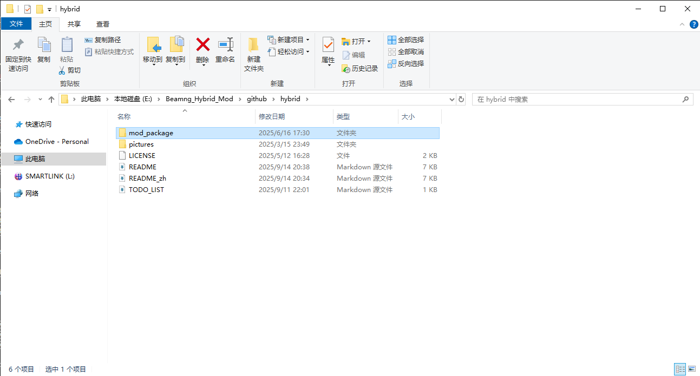
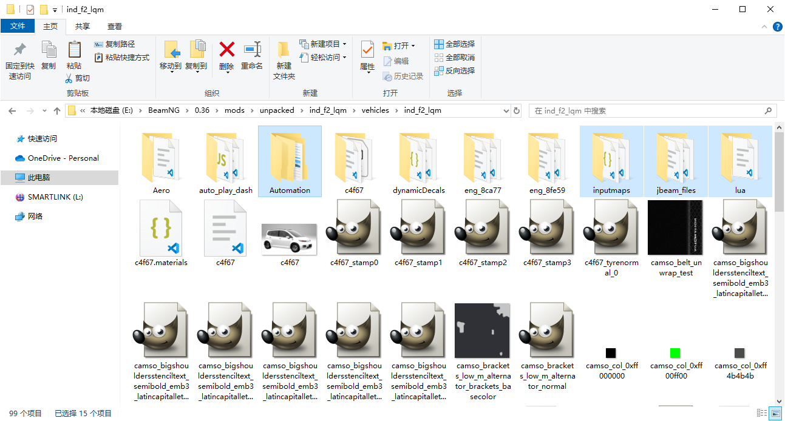

**其他语言: [English](README.md), [汉语](README_zh.md).**\
**待办清单: [待办清单](TODO_LIST.md).**

# 这是一个用于将从《自动化：汽车公司大亨》导出的内燃机汽车，在《车祸模拟器》中转变为具有进阶控制功能的混合动力汽车和纯电动汽车的模组。

# 如果你想在媒体平台上发布包含此模组的内容，请提供此仓库的链接。

以下是使用该模组的指南。

建议：先下载安装 [Visual Studio Code](https://code.visualstudio.com/) 或 [Visual Studio Codium](https://vscodium.com/) 和 [JBeam extension for vscode](https://marketplace.visualstudio.com/items?itemName=beamng.jbeam-editor) [JBeam extension in vsix](https://marketplace.visualstudio.com/_apis/public/gallery/publishers/beamng/vsextensions/jbeam-editor/0.4.3/vspackage) 。

## 混合动力 (Hybrid)

 1.  导出汽车并取消勾选“打包为模组Zip文件”(Zip-Pack Mod)。
    

 2. 从 GitHub 下载资源包和最新的发行版。

    [主模组](https://github.com/NiZhaZi/Beamng_Hybrid_and_EV_Mod/archive/refs/heads/main.zip) 或通过[Git](https://git-scm.com)拉取仓库\
    [.pc 文件编辑助手](https://github.com/NiZhaZi/Hybrid-PC-Edit/releases)\
    [扭矩表生成器](https://github.com/NiZhaZi/Torque-Table-Creator/releases)\
    
    
    

 3. 解压从步骤2第一个链接下载的zip文件（或拉取的文件）。将“mod_package”文件夹下的所有文件复制到导出的汽车模组文件夹中。\
    打开模组文件夹中的“vehicles”文件夹，复制“(vehicle_Name)”文件夹下的所有文件并粘贴到车名文件夹中。

    
    
    
    
    
    

 4. 运行从第二个链接下载的 .exe 文件。选择混合动力形式并点击“复制”按钮。

    

 5. 打开待修改汽车的 .pc 文件，将复制的内容粘贴到“parts”部分下。注释掉重复的行。如果不需要某项功能，可以删除引号内的内容。

    
    
    

 6. 启动游戏并选择该汽车，检查修改是否正确。部分部件可以在游戏菜单中更换。

    
    

 7. ~~可以像这样编辑汽车“main”插槽的“controller”部分，以允许游戏中的AI驾驶修改后的汽车。~~

    

    现在该模组可以自动替换车辆控制器，因此此步骤不再必要。

## 纯电动 (EV)

   1. 导出汽车并取消勾选“打包为模组Zip文件”(Zip-Pack Mod)。

      

   2. 从 GitHub 下载资源包。

      [主模组](https://github.com/NiZhaZi/Beamng_Hybrid_and_EV_Mod/archive/refs/heads/main.zip) 或通过Git拉取仓库\
      [扭矩表生成器](https://github.com/NiZhaZi/Torque-Table-Creator/releases)
      
      

   3. 解压从步骤2第一个链接下载的zip文件。将“EV”文件夹下的所有文件复制到导出的汽车文件夹中。

      

   4. 复制以下代码。

      ```
      "Camso_Engine": "Advance_Engine_ElectricController",
      // "Motor_Drive_Type": "Front_Single_Rear_None",
      // "Motor_Drive_Type": "Front_Dual_Rear_None",
      // "Motor_Drive_Type": "Front_None_Rear_Single",
      // "Motor_Drive_Type": "Front_None_Rear_Dual",
      "Motor_Drive_Type": "Front_Single_Rear_Single",
      // "Motor_Drive_Type": "Front_Single_Rear_Dual",
      // "Motor_Drive_Type": "Front_Dual_Rear_Single",
      // "Motor_Drive_Type": "Front_Dual_Rear_Dual",

      "Camso_ElectricMotor_F": "Single_ElectricMotor_F",
      // "Camso_ElectricMotor_F": "Dual_ElectricMotor_F",
      "Camso_ElectricMotor_R": "Single_ElectricMotor_R",
      //"Camso_ElectricMotor_R": "Dual_ElectricMotor_R",
      "Camso_differential_front": "Single_motor_differential_front",
      // "Camso_differential_front": "Dual_motor_differential_front",
      "Camso_differential_rear": "Single_motor_differential_rear",
      // "Camso_differential_rear": "Dual_motor_differential_rear",

      "Camso_DSE": "EV_DSE_01",
      "Camso_TC": "EV_TC",
      "Camso_ESC": "EV_ESC",
      "Camso_DriveModes": "EV_DriveModes_01",

      "Dynamic_System": "",
      "Dynamic_awd": "",
      "Dynamic_lsd": "",
      "Rear_Wheel_Steering": "",
      "Suspension_Lift": "",
      ```

   5. 打开待修改汽车的 .pc 文件，将复制的内容粘贴到“parts”部分下。注释掉重复的行。如果不需要某项功能，可以删除引号内的内容。

      

   6. 启动游戏并选择该汽车，检查修改是否正确。

      

## Automation 描述脚本 (Automation Description Scripts)

   将 "indexNumber" 替换为 fixtures（ fixture 部件）的索引号，并将其放入 Automation 游戏的描述框中即可使用。

   1. 方向盘 (Steering Wheel)
   ```
   ~prop:indexNumber,steering,0,1,0,0,0,0,-900,900,0,1~
   ```
   
   2. 踏板和手刹 (Pedals and Parking Brake) (对于踏板的第一个数字，-1 代表防火墙安装，1 代表地板安装。)
   ```
   ~prop:indexNumber,throttle_input,-1,0,0,0,0,0,0,40,0,10~
   ~prop:indexNumber,brake_input,-1,0,0,0,0,0,0,40,0,10~
   ~prop:indexNumber,clutch_input,-1,0,0,0,0,0,0,40,0,10~
   ~prop:indexNumber,parkingbrake_input,1,0,0,0,0,0,0,10,0,10~
   ```

   3. 指针 (Pointers) (对于第一个数字，-1 代表顺时针旋转，1 代表逆时针旋转。
      第八个数字代表最大指针角度。
      第十个数字应为指针角度值除以源值。)
   ```
   ~prop:indexNumber,rpmTacho,0,-1,0,0,0,0,0,270,0,0.03~
   ~prop:indexNumber,wheelspeed,0,-1,0,0,0,0,0,360,0,2.95~
   ```

   3. 扩展功能 (Extensional Functions)
   ```
   ~prop:indexNumber,hourNeedle,0,-1,0,0,0,0,0,360,0,1~
   ~prop:indexNumber,minuNeedle,0,-1,0,0,0,0,0,360,0,1~
   ~prop:indexNumber,wiper,0,-1,0,0,0,0,0,90,0,1~
   ~prop:indexNumber,wiper,0,1,0,0,0,0,0,173,0,2~
   ~prop:indexNumber,spoiler,0,0,0,0,1,0.1,0,1,0,0.1~
   ~prop:indexNumber,keyAngle,0,0,-1,0,0,0,0,180,0,1~
   ```